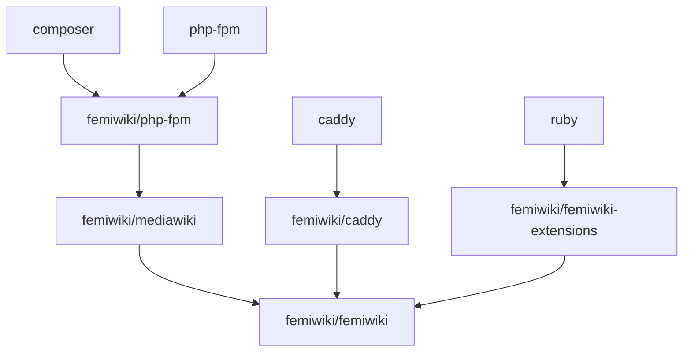

# 페미위키 미디어위키 서버 [![Container Registry]][container registry link] [![Github checks Status]][github checks link]

> [!IMPORTANT]  
> This docker image is specifically designed for the needs of FemiWiki, contains FemiWiki-specific configurations and includes arbitrary MediaWiki extensions. It is not recommended to use this image for general purposes. We recommend using the [Docker official image for MediaWiki](https://hub.docker.com/_/mediawiki/).

한국의 페미니즘 위키인 [femiwiki.com]에 사용되는 미디어위키 도커 이미지입니다. Dockerfile, 테스트용 도커 컴포즈 파일 등 다양한 코드를 담고있습니다.

## Usage of Docker Image

페미위키를 위한 [PHP-FPM] 서버이며 동일한 이미지로 [Caddy] 웹 서버를 실행할 수도 있습니다. 다음 예시 Compose file를 참고해 주세요. compose.yml에서 실행 가능한 개발용 전체 예시를 볼 수 있습니다.

```yml
fastcgi:
  image: ghcr.io/femiwiki/mediawiki
http:
  image: ghcr.io/femiwiki/mediawiki
  command: caddy run
  ports:
    - 80:80
  volumes:
    - ./path/to/Caddyfile:/srv/femiwiki.com/Caddyfile:ro
```

#### MediaWiki

다음 환경 변수를 설정할 수 있습니다.

- `MEDIAWIKI_SERVER`: `$wgServer`를 덮어씁니다. 기본값 `'https://femiwiki.com'`.
- `MEDIAWIKI_DEBUG_MODE`: 설정되었을 경우 미디어위키에서 제공하는 디버그 기능들을 켜고 개발 환경에서 세팅이 어려운 확장기능들을 비활성화합니다.
- `MEDIAWIKI_SKIP_INSTALL`: 설정되었을 경우 컨테이너 시작 시 install.php를 실행하지 않습니다. install.php는 데이터베이스가 세팅되지 않은지 검사하고 초기화하는 일과 LocalSettings.php 생성 작업을 하므로 둘 모두 이미 처리된 경우에 스킵할 수 있습니다.
- `MEDIAWIKI_SKIP_UPDATE`: 설정되었을 경우 컨테이너 시작 시 update.php를 실행하지 않습니다. update.php 실행은 미디어위키 설치 직후 혹은 확장 기능 추가 시에만 필요합니다.
- `MEDIAWIKI_SKIP_IMPORT_SITES`: 설정되었을 경우 컨테이너 시작 시 importSites.php를 실행하지 않습니다. 내용이 변경되지 않았다면 한 데이터베이스에 두 번 이상 실행할 필요가 없습니다.

`/a`에 위치한 LocalSettings.php 파일이나 site-list.xml 파일은 테스트 목적에 따라 교체할 수 있습니다.

#### Caddy

Caddy를 실행할 경우에는 Caddyfile을 `/srv/femiwiki.com/Caddyfile`로 마운트하고 `caddy run`을 커맨드로 사용하여야 합니다. [Usage of Docker Image](#usage-of-docker-image)를 참고하세요. 파일 마운트의 경우 일부 텍스트 편집기로 인한 편집이 무시될 수 있음을 주의하세요. (https://github.com/moby/moby/issues/15793)

```
./caddy/Caddyfile.dev:/srv/femiwiki.com/Caddyfile:ro
```

## Usage of Docker Compose file

[Docker Swarm] 혹은 [Docker Composer]을 이용해, 아래와 같이 간편하게 페미위키를 로컬에서 실행할 수
있습니다. 데이터베이스와 memcached 등 미디어위키에 필요한 서비스들이 실행됩니다.

```bash
docker swarm init

cp dockers/femiwiki/LocalSettings.php development/
cp dockers/femiwiki/Hotfix.php development/

# In case of Docker swarm
docker stack deploy --prune -c compose.yml mediawiki
# If you want some tweaks
docker stack deploy --prune -c compose.yml -c compose.override.yml mediawiki
# In case of Docker Compose
docker compose -f compose.yml up
```

브라우저에서 [http://127.0.0.1:8080]을 방문할 수 있습니다.

## Build

페미위키 개발하실 때엔 아래 커맨드들을 참고해주세요.

```bash
# 도커이미지 빌드
docker build -t femiwiki/mediawiki:dev .
# 수정된 도커이미지를 실행할때엔 아래와 같이
docker service update --force femiwiki_fastcgi

# configs/LocalSettings.php 검사
composer install
composer test
# configs/LocalSettings.php 자동 교정
composer fix
```



&nbsp;

---

The source code of _femiwiki/mediawiki_ is primarily distributed under the terms
of the [GNU Affero General Public License v3.0] or any later version. See
[COPYRIGHT] for details.

[container registry]: https://badgen.net/badge/icon/docker?icon=docker&label
[container registry link]: https://github.com/orgs/femiwiki/packages/container/mediawiki
[github checks status]: https://badgen.net/github/checks/femiwiki/docker-mediawiki
[github checks link]: https://github.com/femiwiki/docker-mediawiki
[femiwiki.com]: https://femiwiki.com
[docker swarm]: https://docs.docker.com/engine/swarm/
[docker composer]: https://docs.docker.com/compose/
[femiwiki/ami]: https://github.com/femiwiki/ami
[how to deploy weekly femiwiki to production]: https://github.com/femiwiki/femiwiki/blob/main/how-to-deploy-weekly-femi-wiki-to-production.md
[php-fpm]: https://php-fpm.org/
[caddy]: https://caddyserver.com/
[http://127.0.0.1:8080]: http://127.0.0.1:8080
[gnu affero general public license v3.0]: LICENSE
[copyright]: COPYRIGHT
